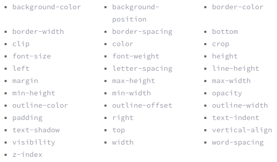
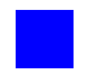

## Animation Defaults
- - - 
### Duration:

Small Interactions:
`transition-duration: 0.2s;`

.2s - .6s tends to be the sweet spot for small interactions.

Large Interactions:
`transition-duraction: .8s`

.8 - 1s tends to be the sweet spot for larger interactions.

### Easing: 

See Single Property Section Below
See Multiple Properties Section Below

When in doubt use: `transition-timing-function: $ibm-snapinout;`

## Animatable Properties:

Here is a general list of all the properties you can animate:

Great example of all the different properties that can be animated [here.](http://leaverou.github.io/animatable/)

## Most Performant Properties:

* Position: `transform: translate(npx,npx);`
* Scale: `transform: scale(n);`
* Rotation: `transform: rotate(ndeg);`
* Opacity: `opacity: 0...1;`

More Information about why these are performant see [this blog post.](http://www.html5rocks.com/en/tutorials/speed/high-performance-animations/)

## Animation Guidelines
- - -
How do machines move?

* Machines move quick with very strong easing at the beginning and/or end of their movements.

How do we recreate that in software?

* After thorough visual research on the movement of machines I found that in order to show the machine motion personality across the interface animation you need to use subtle offset movements. So, how do we create that? There are 2 main things we have to consider when creating these animations: Attributes & Easing as well as, Single vs Sequence Actions.

## 1. Attributes & Easing
--- 

* Define Properties you are going to Animate: Translate, Scale, Opacity, etc. There are two options for animations - Single Property & Multiple Property.

### Single Property Animations:
---

	//box class
	.single-attribute {
		animation: single-attribute 1s $ibm-bouncein;
	}
	
	//keyframes for animation
	@keyframes single-attribute {
	  0% {
	  	transform: scale(0);
	  }
	  100% {
	  	transform: scale(1);
	  }
	}
	

##### Easing Curves:
* Add bounces eases - this add the snap in factor that is lost if you don’t use two properties.
* Snappy Bounces not physics based bouncing.
	* Use of Easing Curves:
		* Entrances = `$ibm-bouncein` (Fast to Slow) 
		* Exits = `$ibm-bounceout` (Slow to Fast)
		* Interactive Elements = `$ibm-bounceinout`

### Offset Property Animations:
---

* Concurrent Properties - 2 options:
	* Option A
		* Start one property alone then animate the additional properties.
	* Option B
		* Both Properties start at the same time then one property ends before the other.
	* Don’t start AND stop multiple properties at the same time. Choose one or the other.

#### Option A:
Start one property alone then animate the additional properties.

	//box class
	.animation-a {
		animation: animation-a 1s $ibm-snapin;
		transform-origin: 0% 100%;
	}
	
	//keyframes for animation
	@keyframes animation-a {
	  0% {
	    transform: scale(0 , 0);
	  }
	  50% {
	    transform: scale(.5 , 0);
	  }
	  100% {
	    transform: scale(1 , 1);
	  }
	}

#### Option B:
Both Properties start at the same time then one property ends before the other.

	//box class
	.animation-b {
	  	animation: animation-b 1s $ibm-snapin;
	 	transform-origin: 0% 100%;
	}
	
	//keyframes for animation
	@keyframes animation-b {
	  0% {
	    transform: scale(0 , 0);
	  }
	  30% {
	    transform: scale(.2 , 0);
	  }
	  80% {
	    transform: scaleY(.5);
	  }
	  100% {
	    transform: scale(1 , 1);
	  }
	}

##### Easing Curves:
* Use of Easing Curves: 
	* Entrances = `$ibm-snapin` (Fast to Slow) 
	* Exits = `$ibm-snapout` (Slow to Fast)
	* Interactive Elements = `$ibm-snapinout`

** Comparisons of the Easing Curves.

## 2. Singluar vs. Sequence of Actions
--- 
### Singular Action

A Singluar action animation is when you animate only one element on the screen & does not contain complementary elements.

### Sequence of Actions

A Sequence of actions animation is where you have multiple elements typically a Primary Action then a Secondary action which complements the Primary.

_

In the example above, the text animations and delay enhance by following the lead of the primary action (scaling of the box).

#### Things to consider with Sequence of Actions:

 * Choreography: - Elements should have cordinate within heirarchy.

### Delays

** How to code delays. 

## Animation Resources
- - -

[Debugging Chrome Animations](http://valhead.com/2015/01/06/quick-tip-chrome-animation-controls/)

## Feedback
Snap In Out - being use the most easing curve
** Need to make the snap in out a little softer.

## Deleted Content

Not working:

* Not working too choppy Ref: [WEA](http://hal.wea.ideanatx.com/)
* You can animate Multiple Prop in two ways:
	* One property THEN the next
		* Ex: Translate (X) 0-100% then Translate (Y) 0-100%

